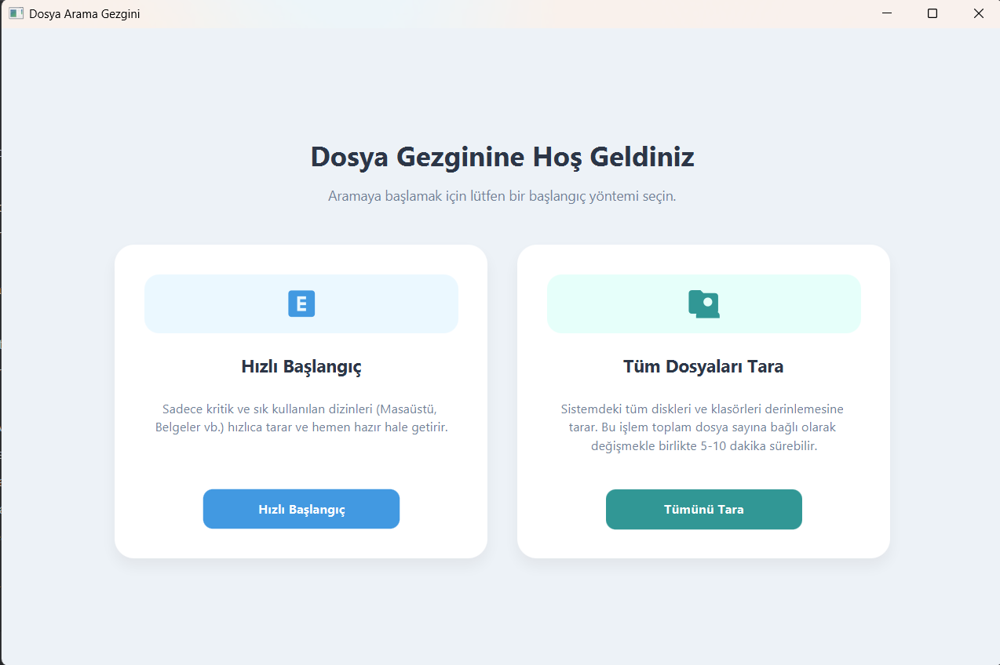
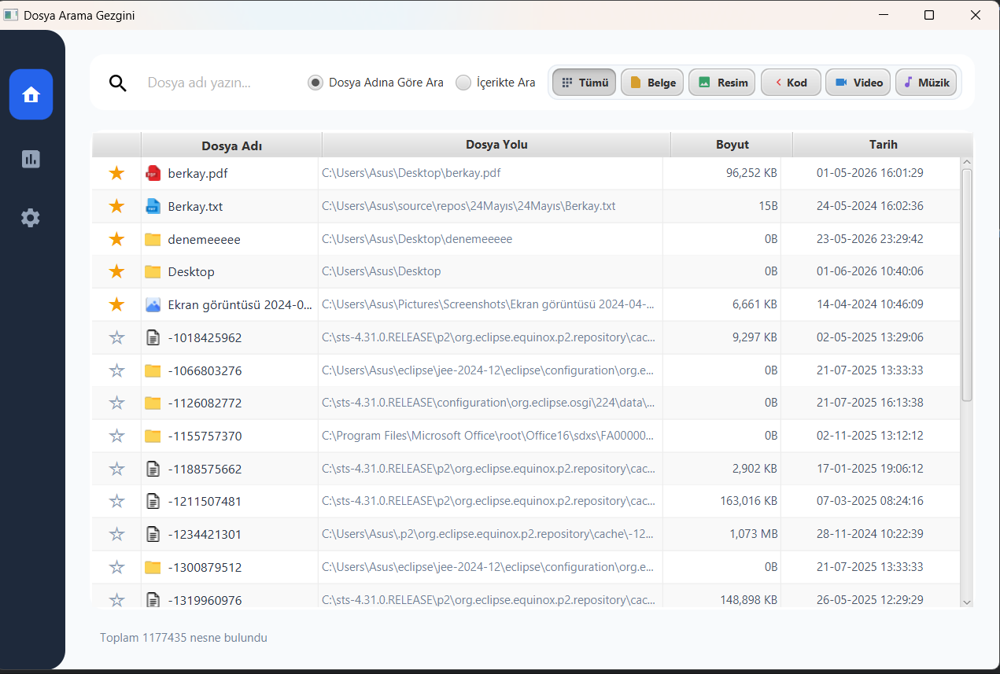
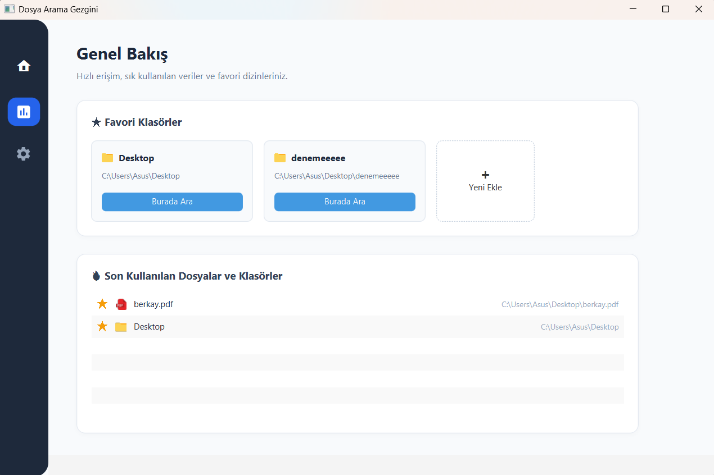
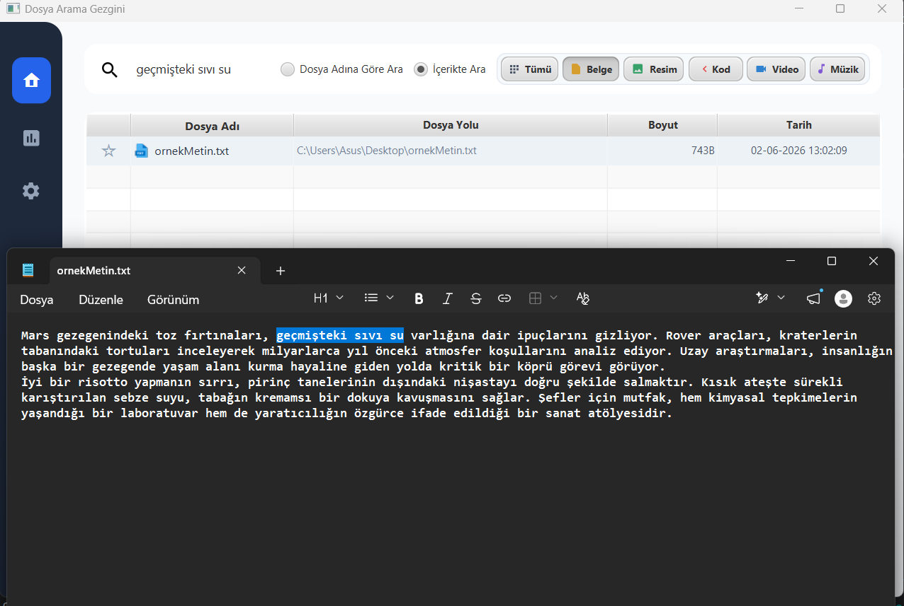
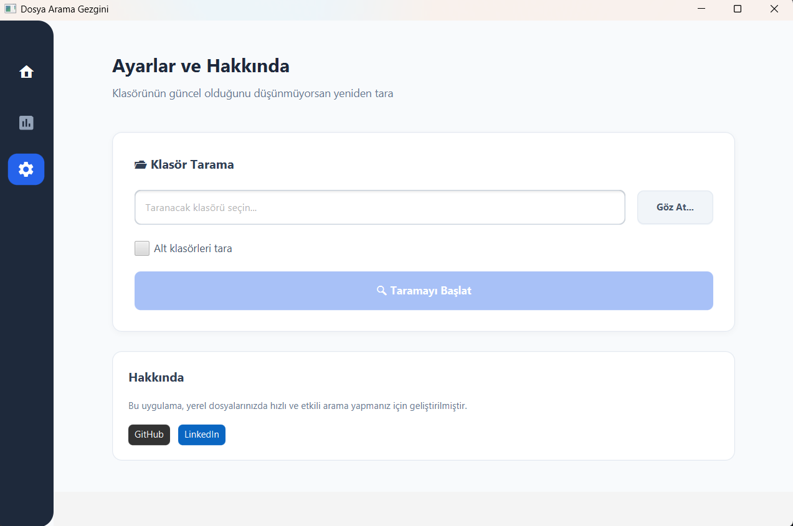
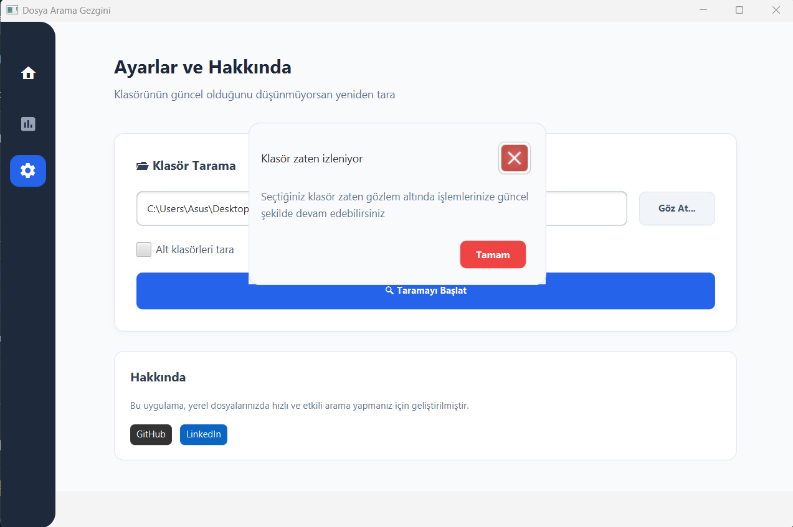
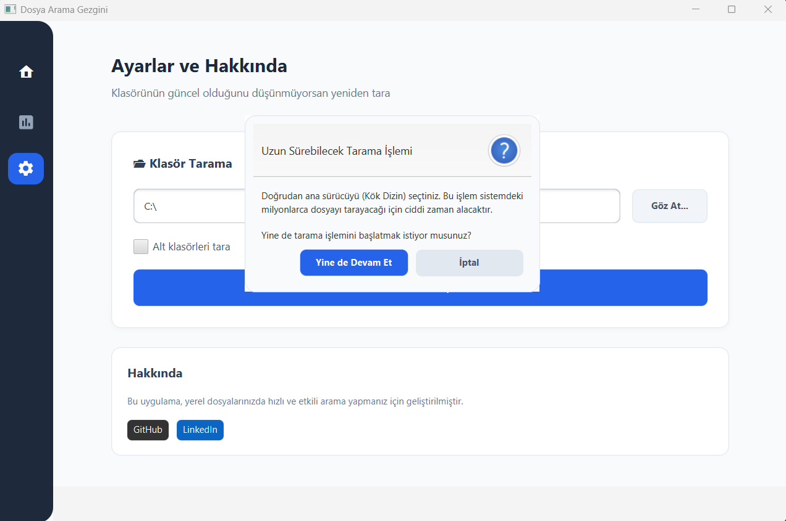

# 🔍 Desktop File Search Engine


---

## 📋 İçindekiler

- [Proje Amacı](#-projenin-amacı)
- [Temel Özellikler](#-temel-özellikler)
- [İlerleme & Performans Metrikleri](#-ilerleme--performans-metrikleri)
- [Teknoloji Yığını](#-teknoloji-yığını)
- [Proje Mimarisi](#-proje-mimarisi)
- [Kurulum](#-kurulum)
- [Kullanım](#-kullanım)
- [Geliştirme Yol Haritası](#-geliştirme-yol-haritası)
- [Katkı](#-katkı)
- [Hakkında](#-hakkında)

---

## 🎯 Projenin Amacı

Bu proje, yerel disk üzerindeki **milyonlarca dosya** arasında **milisaniye seviyesinde** arama yapabilen yüksek performanslı bir masaüstü arama motoru uygulamasıdır.

İşletim sistemlerinin yerleşik arama servislerine alternatif olarak, daha hızlı, özelleştirilebilir ve verimli sonuçlar sunmayı hedeflemektedir.

### Mühendislik Yaklaşımları

- **🔄 Inverted Index Yapısı:** Apache Lucene tabanlı tam metin arama indeksleri ile kelime tabanlı aramaları optimize etme
- **⚙️ Multi-threading (Çoklu İş Parçacığı):** Milyonlarca dosyayı paralel olarak tarayarak CPU verimini maksimize etme
- **🏗️ Decoupled Architecture:** Backend (Spring Boot REST API) ve Frontend (JavaFX GUI) bağımsız modüler yapı
- **📊 Veritabanı Optimizasyonu:** PostgreSQL indekslemesi ile arama karmaşıklığı
- **⏱️ Real-time Watch Service:** Değişen dosyaları tespit etme ve indeks güncelleme

---

## ✨ Temel Özellikler

### Frontend (JavaFX)
✅ Modern ve kullanıcı dostu arayüz  
✅ Gerçek zamanlı arama filtreleri  
✅ Dosya kategorisine göre filtreleme (Resim, Video, Dokuman vb.)  
✅ Favorilere ekleme / Çıkarma  
✅ Sağ tıklama bağlam menüsü (Aç, Yolu Kopyala, Favorilere Ekle)  
✅ Sonsuz kaydırma (Infinite Scroll) ile verimli bellek yönetimi  
✅ Dosya ön izlemesi  
✅ Hızlı erişim bölgeleri (Hot Zones: Desktop, Downloads, Documents, Pictures)  

### Backend (Spring Boot)
✅ REST API ile Frontend iletişimi  
✅ **Apache Lucene** kullanarak tam metin indeksleme  
✅ PostgreSQL veritabanı entegrasyonu  
✅ Çoklu thread worker yapısı:
  - **3 Database Worker Thread:** Batch içinde veritabanı işlemleri (1000 dosya/batch)
  - **5 Index Worker Thread:** Lucene indeksleme işlemleri  
✅ **Delta Scan:** Son taramadan sonra değişen dosyaları tespit etme  
✅ **Hot Zone Watch Service:** Sistem başladığında önemli klasörleri izleme  
✅ Batch upsert ile optimal database performance  
✅ Hata yönetimi ve loglama (SLF4J)  

---
## 🖼️ Arayüz Görüntüleri

Projenin JavaFX ile geliştirilen modern ve akıcı arayüzünden bazı görünümler:

| Başlangıç Ekranı | Ana Arama Paneli |
| :--- | :--- |
|  |  |

| Genel Bakış | Lucene Arama Sonuçları |
| :--- | :--- |
|  |  |

| Ayarlar Paneli | Klasör İzleme Uyarısı |
| :--- | :--- |
|  |  |

| Kök Dizin Uyarı Mesajı |
| :--- |
|  |

---
### 🖥️ Demo & Nasıl Çalışır?

Aşağıdaki açılır menüden demo videomuzu izleyebilirsiniz:

<details>
<summary>🎬 <b>Uygulama Demosunu Göster / Gizle</b></summary>
<br>

<video src="https://github.com/user-attachments/assets/84dc39ea-753f-4eb3-bfc9-091691e9d450" controls muted width="100%"></video>
</details>

---
## 📊 İlerleme & Performans Metrikleri

| Metrik | Değer |
|--------|-------|
| Tarama Edilen Dosya Sayısı | 1,100,000+ |
| Toplam Tarama Süresi | ~6 dakika |
| Veritabanı Yazma Performance | Batch 1000/işlem |
| Arama Yanıt Süresi (Dosya Adı) | 100ms-150ms |
| Arama Yanıt Süresi (Metin İçeriği) | <100ms |
| Veritabanı Engine | PostgreSQL |
| Thread Worker Sayısı | 8 (3 DB + 5 Index) |
| Desteklenen Metin Dosyaları | .txt, .java, .log, .md |

### Başarılan Kilometre Taşları
- ✅ Backend çekirdek yapısının kurulması
- ✅ PostgreSQL veritabanı modelleme
- ✅ Lucene tabanlı indeksleme
- ✅ JavaFX UI tasarımı
- ✅ Multi-threading optimizasyonu
- ✅ WatchService ile gerçek zamanlı tarama
- ✅ Delta scan implementasyonu

---

### Build & Tools
- **Maven** (Proje yönetimi)
- **Java Modules** (Modüler sistem)

---

## 🏗️ Proje Mimarisi

### Klasör Yapısı
```
File-Search-Engine/
├── FileSearchBackend/          # Spring Boot Backend
│   ├── src/main/java/
│   │   └── com/berkaykomur/filesearchbackend/
│   │       ├── controller/     # REST API endpoints
│   │       ├── service/        # Business logic
│   │       │   ├── DeltaScanService        # Değişim taraması
│   │       │   ├── LuceneIndexService   #Lucene indexleme
│   │       │   └── HotZoneWatchService      # Real-time izleme
│   │       │   └── ...
│   │       ├── worker/         # Multi-threading workers
│   │       │   ├── FileProducer             # Dosya tarayıcı
│   │       │   ├── DatabaseWorker           # DB işlem worker
│   │       │   ├── IndexWorker              # Lucene worker
│   │       │   └── FileCoordinator          # Koordinasyon
│   │       ├── repository/     # JPA Repositories
│   │       ├── model/          # Entity sınıfları
│   │       ├── dto/            # Data Transfer Objects
│   │       ├── mapper/         # Entity-DTO mapping
│   │       ├── exception/      # Exception handling
│   │       └── config/         # Spring configuration
│   └── pom.xml                 # Maven konfigürasyonu
│
├── FileSearchFrontend/         # JavaFX Frontend
│   ├── src/main/java/
│   │   └── com/berkaykomur/filesearchfrontend/
│   │       ├── FileApplication.java         # Entry point
│   │       ├── view/            # FXML Controllers
│   │       ├── service/         # API calls
│   │       ├── manager/         # Business logic
│   │       ├── dto/             # Data models
│   │       ├── util/            # Utility classes
│   │       ├── enums/           # Enumerations
│   │       └── resources/       # FXML & CSS files
│   └── pom.xml                 # Maven konfigürasyonu
│
└── README.md                   # Bu dosya
```

### İşlem Akışı (Data Flow)

```
┌─────────────────────────────────────────────────────────────┐
│                     USER INTERFACE (JavaFX)                 │
└────────────────────────┬────────────────────────────────────┘
                         │ HTTP Requests
                         ▼
┌─────────────────────────────────────────────────────────────┐
│                   SPRING BOOT REST API                       │
│  ┌────────────────────────────────────────────────────────┐ │
│  │ Controllers → Services → Repositories                 │ │
│  └────────────────────────────────────────────────────────┘ │
└────────────────────────┬────────────────────────────────────┘
         │               │                    │
         ▼               ▼                    ▼
    ┌─────────┐  ┌──────────────┐  ┌─────────────────┐
    │PostgreSQL│  │Apache Lucene │  │HotZoneWatchSvc │
    │ Database │  │   Indexing   │  │ (Real-time)    │
    └─────────┘  └──────────────┘  └─────────────────┘
```

### Multi-threading Mimarisi

```
┌─────────────────────────────────────────────────────────────┐
│                    FileCoordinator (Main)                    │
└─────────────────────────────────────────────────────────────┘
          │
    ┌─────┴─────┐
    │           │
    ▼           ▼
┌─────────┐  ┌──────────────┐
│Producer │  │Consumer Pool │
└────┬────┘  └──────┬───────┘
     │              │
     │              ├─→ [DatabaseWorker Thread-1] (Save to DB)
     │              ├─→ [DatabaseWorker Thread-2] (Save to DB)
     │              ├─→ [DatabaseWorker Thread-3] (Save to DB)
     │              ├─→ [IndexWorker Thread-1] (Index files)
     │              ├─→ [IndexWorker Thread-2] (Index files)
     │              ├─→ [IndexWorker Thread-3] (Index files)
     │              ├─→ [IndexWorker Thread-4] (Index files)
     │              └─→ [IndexWorker Thread-5] (Index files)
     │
     └─→ BlockingQueue (FileEntity)
     └─→ BlockingQueue (Path - for indexing)
```

---

## 💻 Kurulum

### Ön Gereksinimler
- **Java 17+** 
- **Maven 3.8+**
- **PostgreSQL 12+**
- **Git**

### Adım 1: Depo İndir
```bash
git clone https://github.com/berkya0/File-Search-Engine.git
cd File-Search-Engine
```

### Adım 2: PostgreSQL Veritabanı Konfigürasyonu
```sql
-- PostgreSQL'de veritabanı ve tabloları oluştur
CREATE DATABASE filesearch;

-- Backend application.properties'de bağlantı ayarları
# src/main/resources/application.properties
spring.datasource.url=jdbc:postgresql://localhost:5432/filesearch
spring.datasource.username=postgres
spring.datasource.password=your_password
spring.jpa.hibernate.ddl-auto=update
```

### Adım 3: Backend Derle ve Çalıştır
```bash
cd FileSearchBackend
mvn clean install
mvn spring-boot:run
```

Backend default olarak `http://localhost:8080` üzerinde çalışacaktır.

### Adım 4: Frontend Derle ve Çalıştır
```bash
cd FileSearchFrontend
mvn clean install
mvn javafx:run
```

---

## 🎮 Kullanım

### Backend API Endpoints

#### Tarama İşlemleri
```bash
# Hızlı başlangıç (Desktop, Downloads, Documents, Pictures)
POST /api/scan/quick-start

# Tam tarama
POST /api/scan/full?rootPath=/path/to/scan

# Tek klasör taraması
POST /api/scan/single-directory?path=/path/to/directory
```

#### Arama
```bash
# Dosya adı ve içeriğe göre arama
GET /api/search?query=keyword&extensions=txt,pdf&page=0&size=20

# Favoriler
GET /api/favorites
POST /api/favorites/toggle?path=/file/path
```

#### Tarama Durumu
```bash
# Son tarama zamanı
GET /api/scan/last-scan-time
```

### Frontend Kullanımı

1. **Uygulama Başlatıldığında:**
   - İlk açılışta: Onboarding ekranı → Hedef klasörü seçin
   - Sonraki açılışlarda: Otomatik delta scan yapılır

2. **Arama Yapma:**
   - Üst arama kutusuna metin yazın
   - Kategori filtreleri seç (Tümü, Resim, Video, Dokuman, Müzik)
   - Sonuçlar gerçek zamanlı gösterilir

3. **Dosya Yönetimi:**
   - Sağ tıkla → Aç (Varsayılan uygulamada aç)
   - Sağ tıkla → Yolu Kopyala (Pano'ya kopyala)
   - Sağ tıkla → Favorilere Ekle/Çıkar

---

## 📈 Geliştirme Yol Haritası

### Tamamlanan Görevler ✅
- [x] Backend çekirdek yapısı (Spring Boot 4.x)
- [x] PostgreSQL entegrasyonu
- [x] Lucene indeksleme sistemi
- [x] JavaFX kullanıcı arayüzü
- [x] Multi-threading optimizasyonu (8 worker thread)
- [x] WatchService real-time izleme
- [x] Delta scan implementasyonu
- [x] Favoriler sistemi
- [x] Arama geçmişi

---
## 🚀 Performans Optimizasyonları

### Database
- **Indexing:** file_name, file_path, extension üzerinde B-tree indeksleri
- **Batch Operations:** 1000 dosya başına batch UPSERT
- **Connection Pooling:** HikariCP ile optimal bağlantı havuzu

### Indexing
- **Lucene Multi-threaded:** 5 paralel worker thread
- **Batch Indexing:** 1000 dosya başına batch commit
- **Content Filtering:** 10MB üzeri dosyalar atlanıyor
- **Selective Indexing:** Sadece metin dosyaları indeksleniyor (.txt, .java, .log, .md)

### Frontend
- **Infinite Scrolling:** Bellek verimliliği için sayfalama
- **Lazy Loading:** Ekranda görünen veriler yükleniyor
- **Caching:** Son arama sonuçları cache'de tutulur

### Exclusions
Performans koruması için şu klasörler otomatik atlanıyor:
- `node_modules/` (npm packages)
- `.git/` (git repository)
- `target/` (maven build)
- `build/` (gradle build)
- `AppData/` (system data)
---

## 👨‍💻 Hakkında

**Geliştirici:** Berkay Kömür  
**Eğitim:** Kırıkkale Üniversitesi - Bilgisayar Mühendisliği  
**İletişim:** 
- LinkedIn: [linkedin.com/in/berkya](https://www.linkedin.com/in/berkya)
- GitHub: [@berkya0](https://github.com/berkya0)

---
